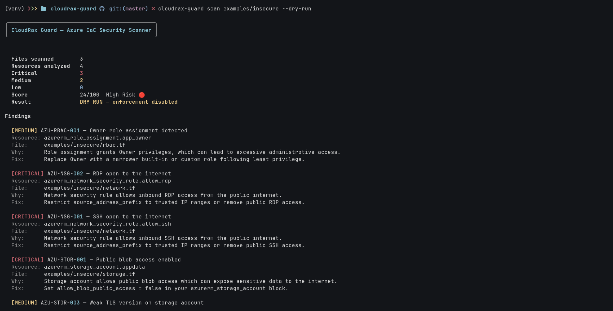
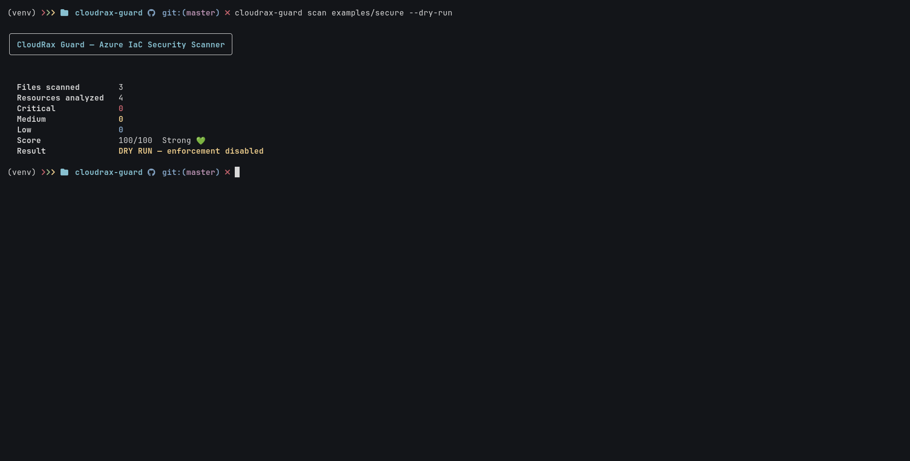
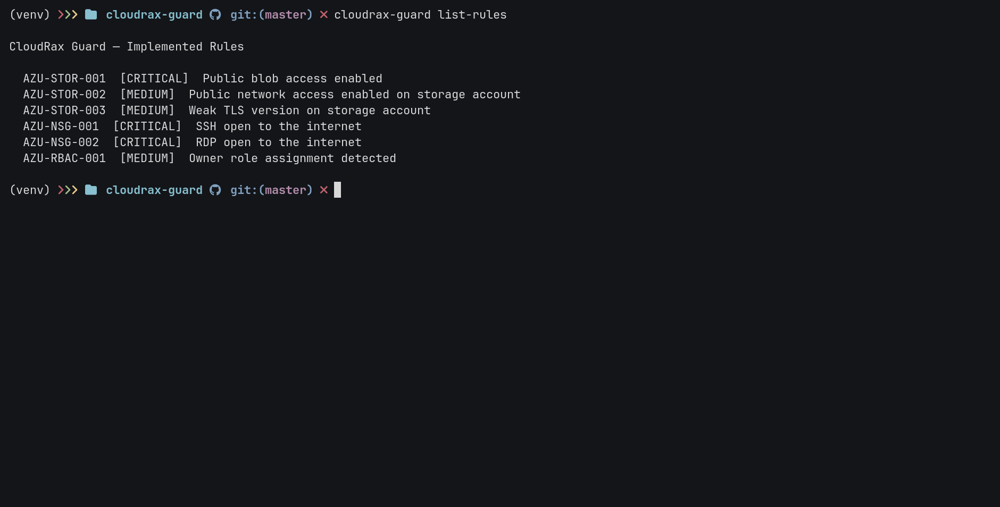

# CloudRax Guard

Azure-focused policy-as-code guardrail engine for Terraform. CloudRax Guard scans Infrastructure-as-Code before deployment, detects risky Azure misconfigurations, applies organization-style guardrails, and can block insecure changes in CI/CD.

It is intentionally opinionated:
- Azure-first instead of shallow multi-cloud breadth
- readable Terraform examples for both insecure and secure states
- exception governance with visible suppressed findings
- developer-friendly CLI output plus machine-readable JSON output

## Demo

CloudRax Guard is best understood as a pre-deployment security gate:

1. A developer writes Terraform.
2. CloudRax Guard parses and normalizes Azure resources.
3. OPA/Rego policies evaluate the resulting resource model.
4. Findings are scored and rendered.
5. CI can run in `--dry-run` mode first, then move to enforcement mode.

Add these screenshots to `docs/screenshots/` with the exact names below:

- `cli-insecure-dry-run.png`
  What to capture: running `cloudrax-guard scan examples/insecure --dry-run`
- `cli-secure-pass.png`
  What to capture: running `cloudrax-guard scan examples/secure --dry-run`
- `github-actions-scan-pass.png`
  What to capture: the successful GitHub Actions workflow run summary
- `list-rules-output.png`
  What to capture: running `cloudrax-guard list-rules`

After you add them, these sections will render as the visual proof for the project:






## Why This Exists

Tools like Checkov, tfsec, and Trivy already scan IaC. CloudRax Guard is not trying to beat them on raw rule count. The goal is to build a smaller Azure-first guardrail engine that demonstrates:

- Azure-depth over generic breadth
- policy-as-code with OPA/Rego
- visible exception governance with expiry
- CI-friendly rollout from `--dry-run` to enforcement

That makes it a strong product security and cloud security project because it focuses on prevention at PR stage rather than detection after deployment.

## What It Detects Today

Implemented rules:

| Rule ID | Severity | Description |
| --- | --- | --- |
| `AZU-STOR-001` | Critical | Public blob access enabled on Azure Storage |
| `AZU-STOR-002` | Medium | Public network access enabled on Azure Storage |
| `AZU-STOR-003` | Medium | Weak TLS version on Azure Storage |
| `AZU-NSG-001` | Critical | SSH open to the internet (`0.0.0.0/0:22`) |
| `AZU-NSG-002` | Critical | RDP open to the internet (`0.0.0.0/0:3389`) |
| `AZU-RBAC-001` | Medium | Azure role assignment grants `Owner` privileges |

## Current Features

- Terraform directory scanning
- Azure resource parsing and normalization
- OPA/Rego-backed policy evaluation
- Rich terminal output
- JSON output for automation
- score-based reporting
- visible suppressed findings
- dry-run mode for non-blocking rollout
- GitHub Actions integration
- automated policy fixture harness with `pytest`

## Architecture

CloudRax Guard is built as a simple pipeline:

```text
Terraform files
   ->
Parser
   ->
Normalized Azure resource model
   ->
OPA/Rego policies
   ->
Findings + exceptions + scoring
   ->
Terminal / JSON output
   ->
CI pass or fail
```

### Core Modules

- [`cloudrax_guard/parser/__init__.py`](cloudrax_guard/parser/__init__.py)
  Reads Terraform files and extracts raw resource blocks.
- [`cloudrax_guard/normalizer/__init__.py`](cloudrax_guard/normalizer/__init__.py)
  Converts raw Terraform resources into a policy-friendly Azure model.
- [`cloudrax_guard/policy/__init__.py`](cloudrax_guard/policy/__init__.py)
  Runs OPA against Rego policies and converts results into findings.
- [`cloudrax_guard/exceptions/__init__.py`](cloudrax_guard/exceptions/__init__.py)
  Applies waivers and produces suppressed findings.
- [`cloudrax_guard/scorer/__init__.py`](cloudrax_guard/scorer/__init__.py)
  Calculates a security score and pass/fail result.
- [`cloudrax_guard/reporter/__init__.py`](cloudrax_guard/reporter/__init__.py)
  Renders terminal output.
- [`cloudrax_guard/main.py`](cloudrax_guard/main.py)
  Exposes the CLI commands.

## Repository Layout

```text
cloudrax-guard/
├── cloudrax_guard/
│   ├── exceptions/
│   ├── normalizer/
│   ├── parser/
│   ├── policy/
│   ├── reporter/
│   ├── scorer/
│   ├── main.py
│   └── models.py
├── policies/
│   ├── network/
│   ├── rbac/
│   └── storage/
├── examples/
│   ├── insecure/
│   └── secure/
├── testdata/
│   └── policies/
├── tests/
├── .github/workflows/
└── README.md
```

## Installation

### Prerequisites

- Python 3.12+ recommended
- `opa` installed and available on `PATH`

### Local Setup

```bash
git clone https://github.com/R4x4nJ031/cloudrax-guard.git
cd cloudrax-guard

python -m venv venv
source venv/bin/activate

pip install --upgrade pip
pip install .
```

Install OPA locally:

```bash
curl -L -o opa https://openpolicyagent.org/downloads/latest/opa_linux_amd64_static
chmod +x opa
sudo mv opa /usr/local/bin/opa
opa version
```

## Usage

### Scan Terraform

```bash
cloudrax-guard scan examples/insecure
```

### Dry Run Mode

```bash
cloudrax-guard scan examples/insecure --dry-run
```

`--dry-run` means:
- scan everything
- show all findings
- calculate score
- do not fail the command even when risky findings exist

This is useful when teams are adopting guardrails gradually.

### JSON Output

```bash
cloudrax-guard scan examples/insecure --dry-run --format json
```

### List Rules

```bash
cloudrax-guard list-rules
```



## Example Output

### Insecure Terraform

Command:

```bash
cloudrax-guard scan examples/insecure --dry-run
```

Expected behavior:
- detects public blob access
- detects weak TLS
- detects SSH exposed to the internet
- detects RDP exposed to the internet
- detects `Owner` role assignment
- shows the suppressed storage-network-access rule from `exceptions.yaml`

### Secure Terraform

Command:

```bash
cloudrax-guard scan examples/secure --dry-run
```

Expected behavior:
- no findings
- score `100/100`

## Exceptions

CloudRax Guard supports simple exception governance through [`exceptions.yaml`](exceptions.yaml).

Example:

```yaml
exceptions:
  - rule_id: AZU-STOR-002
    resource: azurerm_storage_account.appdata
    reason: "Temporary public access during migration"
    approved_by: "security-team"
    expires_on: "2026-12-01"
```

When an exception matches:
- the finding is suppressed
- it appears in the `Suppressed Findings` section
- the scan remains auditable instead of silently ignoring the issue

This is one of the most realistic parts of the project because real security teams care about approved exceptions, not just raw detections.

## Policy Testing Harness

Each implemented rule has pass/fail Terraform fixtures under [`testdata/policies`](testdata/policies).

Structure:

```text
testdata/policies/
├── AZU-STOR-001/
│   ├── pass/
│   └── fail/
├── AZU-STOR-002/
│   ├── pass/
│   └── fail/
├── AZU-STOR-003/
│   ├── pass/
│   └── fail/
├── AZU-NSG-001/
│   ├── pass/
│   └── fail/
├── AZU-NSG-002/
│   ├── pass/
│   └── fail/
└── AZU-RBAC-001/
    ├── pass/
    └── fail/
```

Run the harness:

```bash
pytest -q
```

What it validates:
- fail fixtures must trigger the target rule
- pass fixtures must not trigger the target rule

This makes the policy pack regression-safe and much more credible as a security engineering project.

## CI/CD Integration

GitHub Actions workflow:
- [`.github/workflows/scan.yml`](.github/workflows/scan.yml)

Current workflow behavior:
- installs Python
- installs OPA
- installs CloudRax Guard
- scans secure examples in enforce mode
- scans insecure examples in dry-run mode

This demonstrates the real adoption pattern:
- prove clean infra passes
- show risky infra findings
- avoid immediate blocking on intentionally insecure demo files

## Example Terraform Sets

### Insecure

- [`examples/insecure/storage.tf`](examples/insecure/storage.tf)
- [`examples/insecure/network.tf`](examples/insecure/network.tf)
- [`examples/insecure/rbac.tf`](examples/insecure/rbac.tf)

These files intentionally violate implemented rules.

### Secure

- [`examples/secure/storage.tf`](examples/secure/storage.tf)
- [`examples/secure/network.tf`](examples/secure/network.tf)
- [`examples/secure/rbac.tf`](examples/secure/rbac.tf)

These files are intended to pass the current rule set cleanly.

## Scoring Model

CloudRax Guard starts at `100` and subtracts points by severity:

- Critical: `-20`
- Medium: `-8`
- Low: `-3`

Grades:

- `90-100` -> Strong
- `75-89` -> Acceptable
- `50-74` -> Risky
- `0-49` -> High Risk

This gives the project a useful risk summary instead of only a raw finding count.


## Commands Summary

```bash
cloudrax-guard scan examples/insecure
cloudrax-guard scan examples/insecure --dry-run
cloudrax-guard scan examples/insecure --format json --dry-run
cloudrax-guard scan examples/secure --dry-run
cloudrax-guard list-rules
pytest -q
```

These 4 are enough for a strong portfolio README without making it feel cluttered.
